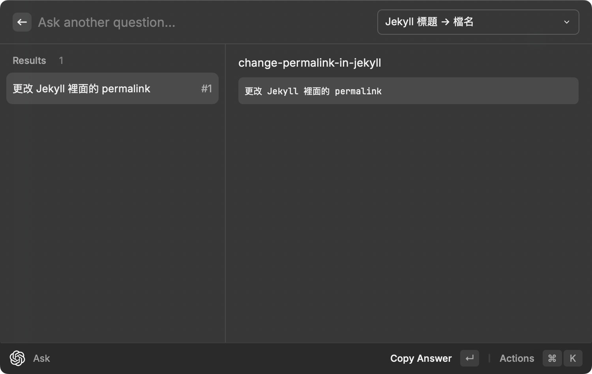

今天決定把這個 Blog 裡的 permalink 從預設的 `/:year/:month/:day/:title:output_ext` 改成 `/:title` ，記錄一下過程。

最重要的修改應該就是在 `_config.yml` 裡加上 `permalink: /:title` ，其中 `/:title` 和 `/:title/` 有些微的差異：

- `/:title` 會生出 `/title.html`
- `/:title/` 會生出 `/title/index.html`

不過其實現在的瀏覽器和網頁伺服器都很聰明，所以實際上用起來這兩者的差異不大。

再來就是想辦法保持原本的文章連結不要壞掉，剛好 GitHub Pages 有支援 [jekyll-redirect-from](https://github.com/jekyll/jekyll-redirect-from) plugin ，所以只要在每篇文章的 front matter 加上 `redirect_from: <OLD_PERMALINK>` 就可以了。

題外話，想看所有 GitHub Pages 支援的 plugins 可以參考 [Dependency versions](https://pages.github.com/versions/) 。

順手弄了一個小 script 來把所有文章加上 `redirect_from` ：



整個修改都在這個 commit 裡： [config: update permalink to /:title, use redirect_from for the legacy links](https://github.com/dm4/blog.dm4.tw/commit/faa66de9b547c411ddf875e96272903155aada27) 。

---

## 同場加映 AI 蹭流量

既然都有 script 了，就順手把目前的文章標題（多半是中文）和檔名（用 - 連起來的英文）整理一下丟給 GPT ，之後就能讓 GPT 幫我產生新文章的英文檔名了！

下圖是產生這篇文章英文檔名的過程，用的是 [Raycast](https://www.raycast.com) 的第三方 [ChatGPT Extension](https://www.raycast.com/abielzulio/chatgpt) ：

